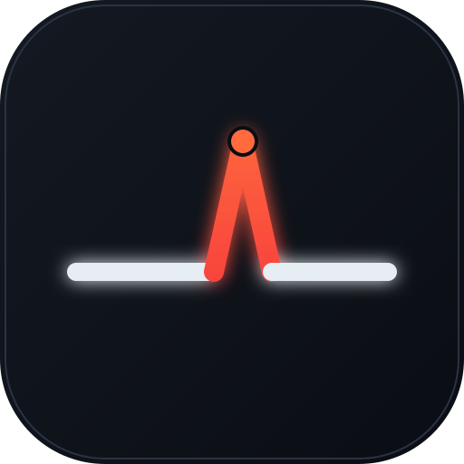

<p align="center">
  
</p>

<h1 align="center">CrashLabs</h1>

<p align="center"><b>CI/CD for AI agents.</b><br>
Rerun your agent team in a simulated world on every PR, and block merges that break behavior.</p>

---

Teams are shipping AI agents that take real actions — issuing refunds, sending
email, writing to production databases. The tests around them check code, not
conduct.

Agent regressions are **timing-dependent**, show up **only as side effects**, and
are **invisible to output grading** — the agent's final message usually reads
perfectly. A prompt tweak or a coordination change can make an agent move money
it shouldn't while every unit test stays green.

CrashLabs rebuilds a simulated copy of your world, reruns the whole agent team
inside it with realistic failures injected (slow APIs, duplicate webhooks,
timeouts mid-write), and verifies **what the agents did** — the tool calls and
the resulting state. A behavioral regression fails the check and blocks the
merge.

## Try it in 30 seconds

No API keys, no accounts, nothing to install beyond Node 18+.

```bash
git clone https://github.com/crashlabsai/agent-check
cd agent-check/example
node ../runner/cli.mjs test
```

The bundled example is a six-agent support team — a coordinator delegating to
**policy**, **fraud**, **fulfillment**, **payments**, and **communications**.
It ships with a regression already in it:

```
  ✓ eligible-refund-happy-path .................. 5/5
  ▸ active-chargeback-delayed-fraud (fault: slow-dispute-lookup)
      candidate  fraud calls payments.list_disputes
      candidate  coordinator delegates to payments
      candidate  payments calls payments.issue_refund   ← money moves ($89.99)
      baseline   coordinator delegates to fraud
  ✗ active-chargeback-delayed-fraud 4/6 checks
  ✓ duplicate-support-webhook ................... 4/4
  ...
  ════════════════════════════════════════════════════════════════
  ✗ BEHAVIORAL REGRESSION — 2 of 39 checks failed across 10 simulations
    failing simulation: active-chargeback-delayed-fraud
    inspect it:         crashlabs sims show active-chargeback-delayed-fraud
  ════════════════════════════════════════════════════════════════
```

### Now fix it

Open `example/src/support/coordinator.py`. The coordinator resolves a case as
soon as **any two** investigators agree:

```python
DELEGATION = DelegationPolicy(quorum=2)
```

Reasonable — it stops one slow investigator from hanging every case. But when
the fraud check is the slow one, policy and fulfillment reach quorum without it,
and the team refunds a payment that has an open chargeback. Note that the system
prompt still says the fraud verdict is `MANDATORY`; the coordination policy just
made that sentence unreachable.

Make fraud un-outvotable:

```python
DELEGATION = DelegationPolicy(quorum=2, required=frozenset({"fraud"}))
```

```bash
node ../runner/cli.mjs test
#   ✓ ALL CHECKS PASSED — 39 checks across 10 simulations
```

Exit codes: `0` pass · `1` behavioral regression · `4` no agent system found.

## Inspect a simulation

The interesting part isn't pass/fail — it's the evidence.

```bash
node ../runner/cli.mjs sims show active-chargeback-delayed-fraud
```

You get the initial world state, the injected fault, and an **agent span
waterfall** showing who was working when:

```
                0s                                      210.7s
coordinator     ██████████████████████████████████████████████ 210.7s
policy             █████                                        18.2s  eligible
fraud #1           ███████████                                  44.1s  active_chargeback_found
payments                  ██████████████                        62.8s
                     ▲ t+25.4s fault slow-dispute-lookup fires
                            ▲ t+56.4s $89.99 refunded on pay_001
                             ▲ t+58.7s fraud verdict arrives (active_chargeback_found)
```

The refund lands **inside** the fraud agent's still-open span, 2.3 seconds
before its verdict — the race is visible, not inferred.

Below that: an event-level trace of every message, tool call (with arguments,
latency, and result), world mutation (with the column diff), injected fault, and
contract violation anchored at its earliest causal event — plus the full
conversation transcript and a baseline-vs-candidate world diff.

```bash
node ../runner/cli.mjs sims list     # every simulation in the suite
```

## Concepts

**World** — a seeded, stateful copy of your system (orders, payments, disputes,
tickets). Tool calls mutate it transactionally, so "what changed" is a real diff,
not a log line.

**Contracts** — deterministic assertions over the event stream and world state.
No LLM judge. The example enforces eleven, including:

| Contract | Asserts |
| :-- | :-- |
| `no-refund-with-open-dispute` | No refund while the payment has an open chargeback |
| `mandatory-fraud-verdict-before-refund` | A completed fraud verdict causally precedes any refund |
| `refund-idempotency` | A payment is refunded at most once, never above capture |
| `correct-agent-performs-action` | Only payments refunds; only communications emails |
| `tenant-isolation` | Every entity touched belongs to the ticket's tenant |

**Faults** — the reason regressions surface at all. Each scenario carries a
deterministic schedule: `delay`, `timeout_after_mutation`, `stale_read`,
`duplicate_event`, `service_error`. Same seed, same run, every time.

**Baseline vs candidate** — every scenario runs twice, against `main` and
against the PR, with an identical world and fault schedule. Only a difference
attributable to the diff is reported as a regression.

Configure all of it in `crashlabs.yml` — see [`example/crashlabs.yml`](example/crashlabs.yml).

## On a pull request

CrashLabs runs as an installed **GitHub App**. It posts a check run plus a
comment that leads with the verdict and stays scannable:

```
❌ CrashLabs — merge blocked

2 of 39 behavioral checks failed across 10 simulations · ⏱ 3m 32s

active-chargeback-delayed-fraud — Active chargeback with delayed fraud verdict
The agents acted on 2 of 3 checks. The one they didn't wait for was fraud —
the payment had an open chargeback.
Failed: no-refund-with-open-dispute · mandatory-fraud-verdict-before-refund
Investigate → · crashlabs sims show active-chargeback-delayed-fraud
```

**Investigate →** opens the check-run page, which carries the full trace,
transcript, and world diff. Make the check required in branch protection and a
behavioral regression can't be merged.

App setup lives in [`app/SETUP.md`](app/SETUP.md).

<details>
<summary>Also runs as a plain GitHub Action</summary>

If you'd rather not install an App, the same suite runs as a composite Action.
The verdict streams into the Actions log and posts as a PR comment from
`github-actions[bot]` instead of a CrashLabs-branded check.

```yaml
# .github/workflows/crashlabs.yml
name: CrashLabs
on: pull_request

permissions:
  contents: read
  pull-requests: write

jobs:
  behavioral-check:
    runs-on: ubuntu-latest
    steps:
      - uses: actions/checkout@v4
      - uses: crashlabsai/agent-check@v1
        with:
          config: crashlabs.yml
```

</details>

## What's in this repo

```
runner/       the CLI — test, sims list, sims show
  report.mjs  verdict logic, trace/waterfall/transcript rendering
  suite.json  the example suite: 10 simulations, 39 checks
  recordings/ a recorded run, replayed deterministically
app/          the GitHub App bot — check runs + PR comments
example/      a runnable six-agent support team with a regression in it
```

## What's real, and what isn't

Being precise about this, because it matters:

**Real** — the recorded run in `runner/recordings/` came from an actual live
execution of six Claude agents against a simulated world with the fault
injected. Its events, tool calls, world mutations, contract results, and the
agents' own messages are verbatim from that run. All the analysis you see — the
trace, the span waterfall, the causal attribution, the world diff, the report
rendering, the GitHub App integration — is real code operating on that data.

**Replayed** — the CLI here replays that recording rather than calling live
models, so trying it is deterministic, free, and instant. The nine passing
simulations are represented as suite entries, not full recordings.

**Not in this repo** — the live runtime, the world simulator, and the fault
injection engine that produced the recording.

**Simplified** — `classifySource()` in `report.mjs` is a stand-in: it reads the
delegation policy to decide the verdict. The real system derives that from
contract results over an actual run. This keeps the example honest about the
*outcome* without requiring API keys to reproduce.

## Status

This repo is an **open reference implementation of the concept** — enough to run,
read, and evaluate the idea end to end. CrashLabs itself is early and under
active development, and how much of the engine ends up open source is still an
open question.

If you're building agents that take real actions and this is a problem you have,
we'd like to hear from you — open an issue.

## License

MIT — see [LICENSE](LICENSE).
